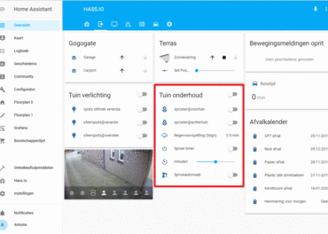

# My Home Assistant sprinkler configuration
This is my personal Home Assistant configuration for my automated garden sprinklers.
If you like this repo, be sure ⭐️ Star this repository.




# Required equipment
* [Electrodragon Wifi IoT Relay Board Based on ESP8266](https://www.electrodragon.com/product/wifi-iot-relay-board-based-esp8266)
* [2/3-Way DN25 G3/4" zone valve ball valve electric valve shut-off valve AC 230V](https://www.amazon.de/gp/product/B0785QQ218/ref=ppx_yo_dt_b_asin_title_o00_s00?ie=UTF8&language=en_GB&psc=1)
* [Power PCB Relay RT1](https://produktinfo.conrad.com/datenblaetter/500000-524999/504175-da-01-en-LEIST_PR__REL_RT1_12A_1UK_230VDC.pdf?direct=)
* [4 ways white distribution box with fixed din rail inside](https://www.aliexpress.com/item/32620949631.html?spm=a2g0s.9042311.0.0.27424c4diNAnTA)


## About
This are currently my devices for my [Home Assistant sprinklerautomation](https://github.com/antoinevandenhurk/Home-Assistant). Each friday morning HASS checks the buienradar every Friday to see if there is enough rain falling in the coming days. If this is less than 10 mm, HASS switches on the  Electrodragon ESP8266 relay supplies the 2-way ball valve via the changeover contact. This allows the water to flow to the sprinkler heads via the water booster system.

## Example configuration

  ###### automations.yaml
```yaml
- id: Sproeiautomaat 01
  alias: Sproeiautomaat
  trigger:
  - at: 06:05:00
    platform: time
  condition:
  - below: '10'
    condition: numeric_state
    entity_id: sensor.br_rain_5d
  - condition: time
    weekday:
    - fri
  action:
  - data:
      entity_id: switch.sproeier_achtertuin
    service: switch.turn_on
  - data:
      message: Sproeisessie wordt ingeschakeld
      target:
      - device/gsm_antoine
    service: notify.push_notify
- id: Sproeiautomaat 02
  alias: Sproeiautomaat afsluiten
  trigger:
  - at: 06:30:00
    platform: time
  condition:
  - condition: state
    entity_id: switch.sproeier_achtertuin
    state: 'on'
  action:
  - data:
      entity_id: switch.sproeier_achtertuin
    service: switch.turn_off
  - data:
      message: Sproeisessie wordt uitgeschakeld
      target:
      - device/gsm_antoine
    service: notify.push_notify
- id: Sproeiautomaat 03
  alias: Sproeitimer
  trigger:
  - entity_id: switch.sproei_timer
    from: 'off'
    platform: state
    to: 'on'
  action:
  - delay: 00:{{ states.input_number.sproeitimer_min.state | int }}:00
  - data:
      entity_id: switch.sproeier_voortuin
    service: switch.turn_off
  - data:
      entity_id: switch.sproeier_achtertuin
    service: switch.turn_off
  - data:
      message: Sproeisessie wordt uitgeschakeld!
      target:
      - device/gsm_antoine
    service: notify.push_notify
  - data:
      entity_id: switch.sproei_timer
    service: switch.turn_off
```
###### switches.yaml
```yaml
- platform: mqtt
  name: "sproeier voortuin"
  command_topic: "cmnd/dragon33/POWER1"
  state_topic: "stat/dragon33/POWER1"
  payload_on: "ON"
  payload_off: "OFF"
  state_on: "ON"
  state_off: "OFF"
  optimistic: false
  qos: 0
  retain: true
  icon: 'mdi:flower'

# Electro dragon Dual 02
- platform: mqtt
  name: "sproeier achtertuin"
  command_topic: "cmnd/dragon33/POWER2"
  state_topic: "stat/dragon33/POWER2"
  payload_on: "ON"
  payload_off: "OFF"
  state_on: "ON"
  state_off: "OFF"
  optimistic: false
  qos: 0
  retain: true
  icon: 'mdi:flower'

# Sproeitijd switch
- platform: template
  switches:
    sproei_timer:
      value_template: "{{ is_state('input_boolean.sproei_timer', 'on') }}"
      turn_on:
        - service: input_boolean.turn_on
          entity_id: input_boolean.sproei_timer
      turn_off:
        - service: input_boolean.turn_off
          entity_id: input_boolean.sproei_timer
  ```
###### input_numbers.yaml
```yaml
# - Sproeitimer
sproeitimer_uur:
  name: uren
  icon: mdi:camera-timer
  initial: 0
  min: 0
  max: 60
  step: 1
sproeitimer_min:
  name: minuten
  icon: mdi:camera-timer
  initial: 30
  min: 0
  max: 60
  step: 2
```
###### sensors.yaml
```yaml
- platform: buienradar
  monitored_conditions:
#     - symbol
#     - humidity
#     - temperature
#     - windspeed
#      current condition:
#     - condition
#     - conditioncode
#     - conditiondetailed
#     - conditionexact
#     - symbol
#     - symbol_1d
#     - symbol_2d
#     - symbol_3d
#     - symbol_4d
#     - symbol_5d
#     - temperature_1d
#     - temperature_2d
#     - temperature_3d
#     - temperature_4d
#     - temperature_5d
#     - rainchance_1d
#     - rainchance_2d
#     - rainchance_3d
#     - rainchance_4d
#     - rainchance_5d
#     - sunchance_1d
#     - sunchance_2d
#     - sunchance_3d
#     - sunchance_4d
#     - sunchance_5d
#     - rain_1d
#     - rain_4d
#     - rain_2d
#     - rain_3d
     - rain_5d
#     - precipitation
#     - precipitation_forecast_average
#     - precipitation_forecast_total
```
